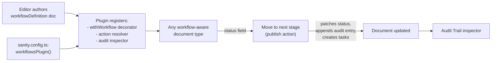

# @sanity-labs/sanity-plugin-workflows

Editor-configurable document workflows for Sanity Studio.

Content authors define the workflow — stages, off-ramps, roles, task templates, completion gating, publish gating — in a `workflowDefinition` document. The plugin then takes care of the Studio wiring: it injects a `status` field, an `assignments` array, and an audit trail onto every workflow-aware document, turns the `Publish` action into a **Move to _next stage_** action, and surfaces an **Audit Trail** inspector.


The simplest working setup is one line of config (`plugins: [workflowsPlugin()]`) plus one `workflowDefinition` document authored in Studio.

- **Full API reference** → [docs/reference.md](docs/reference.md)
- **Engine + UI primitives the plugin is built on** → [`@sanity-labs/workflow-kit`](https://github.com/sanity-labs/workflow-kit)

---

## Prerequisites

The plugin works on any Sanity plan. The core workflow — status field, stages, transitions, audit trail, completion gating, publish gating — is authored in Studio as data and needs no specific plan.

Where the plan does matter is **role-access**. The plugin's gating overrides, off-ramp permissions, and assignee-eligibility checks all map each workflow role to one or more Sanity project roles. Free and Team plans give you the three built-in project roles (`administrator`, `editor`, `viewer`); Enterprise plans add custom project roles, which unlock real separation of duties. The plugin is at its most expressive on Enterprise, but nothing about it requires Enterprise.

---

## Concepts

| Term                 | What it is                                                                                                                                    |
| -------------------- | --------------------------------------------------------------------------------------------------------------------------------------------- |
| `workflowDefinition` | A Studio document that describes _one_ workflow. Targets a single `documentType` and owns that type's stages, off-ramps, and roles.           |
| Stage                | A step on the happy path (e.g. `draft` → `in_review` → `approved`). Each stage has a label, icon, color, and optional tasks and gating rules. |
| Off-ramp             | A terminal/abandoned state that isn't part of the forward path (e.g. `spiked`, `archived`). Can unpublish the document on entry.              |
| Role                 | A workflow role (e.g. Reporter, Section Editor) authored inside the `workflowDefinition` document. Each role maps to one or more Sanity project roles via `workflowRole.projectRoles[]`; the plugin uses that mapping to resolve which Sanity users count as which workflow role at runtime. |
| Task template        | A task that's auto-created on stage entry, with an assignee role and due date. Tasks live in the `-comments` addon dataset.                   |
| Completion gating    | If on, a stage can't be left until its required tasks are closed. Roles listed in `gatingOverrideRoles` can override.                         |
| Publish gating       | Documents can only be published when the current stage has `enablePublishing: true`. Enforced by a custom validator.                          |
| Audit trail          | Every transition appends a `setStatus` entry to the document's `statuses` array. Rendered in a per-document inspector.                        |

### How the pieces fit



---

## Quickstart

About 5 minutes from `pnpm install` to your first transition.

### 1. Install

```sh
pnpm add @sanity-labs/sanity-plugin-workflows @sanity-labs/workflow-kit
```

> `@sanity-labs/workflow-kit` is a peer of this package — you need it in your project even if you never import from it directly.

### 2. Register the plugin

```ts
// sanity.config.ts
import { defineConfig } from "sanity";
import { workflowsPlugin } from "@sanity-labs/sanity-plugin-workflows";

export default defineConfig({
  name: "default",
  title: "My Studio",
  projectId: "your-project-id",
  dataset: "production",
  plugins: [workflowsPlugin()],
  schema: {
    types: [
      // your existing types
    ],
  },
});
```

With zero options, the plugin:

- Registers the workflow schema types (`workflowDefinition`, stages, off-ramps, roles, task templates, assignments).
- Applies the `withWorkflow()` decorator to all document types except a small default exclude list, injecting `status`, an `assignments` array, `statuses` (audit trail), and `pendingTransitionReason` fields plus a publish-gating validator.
- Registers the audit-trail publish action wrapper and the **Audit Trail** inspector.

### 3. Author a workflowDefinition in Studio

Start Studio (`sanity dev`), open the new **Workflow Definition** document type, and create one:

1. **Document Type** — the `name` of an existing document type, e.g. `article`.
2. **Roles** — add at least one (e.g. _Reporter_, slug `reporter`, mapped to the Sanity project roles that count as reporters).
3. **Stages** — add at least two. For the final "ready to publish" stage, toggle **Allow Publishing** on.
4. Publish the definition.


### 4. See the transition action appear

Open any document of the target type. You should now see:

- A `Status` field at the top (the injected `StatusPathInput`).
- The publish button has become **Move to _next stage_**, styled with the next stage's icon and color.
- Open the **Audit Trail** inspector from the document header — it streams updates as you move through stages.


### 5. Move through stages

Click **Move to _next stage_**. If the stage has task templates or stage guidance, you'll see a confirmation dialog. Confirm, and the document's `status` is patched, tasks are created in the `-comments` addon dataset, and a new entry appears in the audit trail.


That's a complete workflow. Everything below is optional customization.

---

## How-to guides

### Track team assignments on content documents

Every workflow-aware document gets an `assignments` array field injected automatically. No schema edit required. Each entry captures a workflow role (auto-populated from `workflowDefinition.roles[]`) and the Sanity user id assigned to it — so editors can record who's the reporter on this article, who's the section editor, and so on, with the picker always in sync with the current workflow definition.

#### Opt out or customize

_Opt out entirely_ — suppress the injection with a plugin option:

```ts
workflowsPlugin({ injectAssignments: false });
```

Or declare your own `assignments` field on the document type, and the decorator will leave it alone.

_Customize_ — if you need additional fields on assignments (e.g. a channel or market categorization), define your own schema type with `name: 'assignment'` and register it via `workflowsPlugin({schemaTypes: [yourAssignment]})`. The plugin merges schema types by name, so yours replaces the default.

Copy the shape from the plugin's own `assignmentObject` export (exported from `@sanity-labs/sanity-plugin-workflows/schema`) as a starting point.

### Exclude document types from status injection

Some document types shouldn't have workflow state — singletons, config documents, embedded blocks surfaced as documents, etc. By default the plugin already excludes:

```
globalPopupModal, globalSeo, locale, footer, navbar,
tableView, tableViewColumn, workflowDefinition, workflowsConfig
```

To add your own, disable the plugin's built-in decorator and run `withWorkflow` yourself with your exclude list:

```ts
// sanity.config.ts
import { workflowsPlugin } from "@sanity-labs/sanity-plugin-workflows";
import { withWorkflow } from "@sanity-labs/sanity-plugin-workflows/schema";
import { decorateSchemaTypes } from "@sanetti/shared/studio/schemaTypes"; // your own utility

export default defineConfig({
  // ...
  schema: {
    types: (prev) =>
      decorateSchemaTypes(prev, [
        withWorkflow({ exclude: ["siteSettings", "homepage"] }),
      ]),
  },
  plugins: [workflowsPlugin({ schemaTypes: [] })],
});
```

### Keep a pre-existing `status` field and add only the audit trail

If a document type already owns a `status` field you want to keep (e.g. a domain-specific lifecycle), the decorator will detect that and skip injection entirely — leaving your field alone. To still get the audit-trail `statuses` array with its custom UI, add `reusableStatusTrackerField` manually:

```ts
// schemaTypes/documents/storyAdaptationType.ts
import { defineField, defineType } from "sanity";
import { reusableStatusTrackerField } from "@sanity-labs/sanity-plugin-workflows/schema";

export const storyAdaptationType = defineType({
  name: "storyAdaptation",
  type: "document",
  fields: [
    defineField({ name: "title", type: "string" }),
    defineField({
      name: "status",
      type: "string",
      options: { list: ["draft", "live"] },
    }),
    { ...reusableStatusTrackerField, group: "workflows" },
  ],
  groups: [{ name: "workflows", title: "Workflows" }],
});
```

### Compose the action resolver with others, and disable the plugin's built-ins

The plugin mounts a single action resolver that wraps publish, inserts off-ramp slot actions, and adds the transition dialog. When your Studio already has its own action resolvers to compose with, disable the plugin's defaults and mount the pieces yourself:

```ts
// sanity.config.ts
import { defineConfig } from "sanity";
import { workflowsPlugin } from "@sanity-labs/sanity-plugin-workflows";
import { workflowAuditTrailActionResolver } from "@sanity-labs/sanity-plugin-workflows/actions";
import { createWorkflowAuditInspector } from "@sanity-labs/sanity-plugin-workflows/audit";
import type { DocumentActionComponent } from "sanity";

type ActionResolver = typeof workflowAuditTrailActionResolver;

const composeActionResolvers = (
  ...resolvers: ActionResolver[]
): ActionResolver => {
  return (prev, context) =>
    resolvers.reduce(
      (acc: DocumentActionComponent[], resolve) => resolve(acc, context),
      prev,
    );
};

const combinedActions = composeActionResolvers(
  yourCustomActionResolver,
  workflowAuditTrailActionResolver,
  yourOtherActionResolver,
);

export default defineConfig({
  // ...
  plugins: [
    workflowsPlugin({
      actions: false,
      inspector: false,
      schemaTypes: workflowSchemaTypes,
    }),
  ],
  document: {
    actions: combinedActions,
    inspectors: (prev) => [createWorkflowAuditInspector(), ...prev],
  },
});
```

`workflowAuditTrailActionResolver` is the composite the plugin uses internally. It wraps `publish`, inserts off-ramp actions from `workflowOffRampDocumentActionsResolver`, and runs the transition wrapper from `workflowTransitionActionResolver`.

### Pin the Sanity API version

Every internal client call uses a single API version (default `'2026-04-12'`, defined in [src/internal/plugin/constants.ts](src/internal/plugin/constants.ts)). Pin a different version when you need to align with the rest of your Studio:

```ts
workflowsPlugin({ apiVersion: "2026-04-12" });
```

The value is stored globally on the plugin's internal constants module — set it once at registration time.

### Show only the audit inspector

Disable actions and mount the inspector on its own when you want history without the transition dialog:

```ts
workflowsPlugin({ actions: false, inspector: true });
```

Or disable both and mount the inspector yourself with custom title/icon:

```ts
import { ClipboardListIcon } from "@sanity/icons";
import { createWorkflowAuditInspector } from "@sanity-labs/sanity-plugin-workflows/audit";

const auditInspector = createWorkflowAuditInspector({
  icon: ClipboardListIcon,
  title: "Status history",
});

export default defineConfig({
  // ...
  plugins: [workflowsPlugin({ actions: false, inspector: false })],
  document: {
    inspectors: (prev) => [auditInspector, ...prev],
  },
});
```

The inspector only renders when `useHasWorkflow(documentType)` returns `true`, i.e. a published `workflowDefinition` document exists for that type.

### Ship a ready-to-import `workflowDefinition`

You can seed a workflow as an NDJSON import so a repo clone doesn't require authoring a workflow from scratch:

```json
{
  "_id": "workflowDefinition.article",
  "_type": "workflowDefinition",
  "title": "Article workflow",
  "slug": { "_type": "slug", "current": "article" },
  "documentType": "article",
  "forwardOnly": false,
  "roles": [
    {
      "_type": "workflowRole",
      "_key": "role-reporter",
      "label": "Reporter",
      "slug": { "_type": "slug", "current": "reporter" },
      "projectRoles": ["editor", "administrator"]
    }
  ],
  "stages": [
    {
      "_type": "workflowStage",
      "_key": "stage-draft",
      "label": "Draft",
      "slug": { "_type": "slug", "current": "draft" },
      "color": "#9CA3AF",
      "enablePublishing": false
    },
    {
      "_type": "workflowStage",
      "_key": "stage-review",
      "label": "In Review",
      "slug": { "_type": "slug", "current": "in_review" },
      "color": "#3B82F6",
      "enablePublishing": false
    },
    {
      "_type": "workflowStage",
      "_key": "stage-approved",
      "label": "Approved",
      "slug": { "_type": "slug", "current": "approved" },
      "color": "#10B981",
      "enablePublishing": true
    }
  ]
}
```

Save as `workflow.article.ndjson` and import:

```sh
npx sanity dataset import workflow.article.ndjson production
```

---

## Package entrypoints

The plugin exposes four entrypoints. Each maps directly to a section in [docs/reference.md](docs/reference.md).

| Entrypoint                                     | What you get                                                                                                                                                                                                                  |
| ---------------------------------------------- | ----------------------------------------------------------------------------------------------------------------------------------------------------------------------------------------------------------------------------- |
| `@sanity-labs/sanity-plugin-workflows`         | `workflowsPlugin`, `WorkflowsPluginOptions` — the plugin function and its options type.                                                                                                                                       |
| `@sanity-labs/sanity-plugin-workflows/schema`  | `withWorkflow`, every default schema type, every generator function, `reusableStatusTrackerField`, `generateStatusType`, `WorkflowListOption`, `SchemaDecorator`.                                                             |
| `@sanity-labs/sanity-plugin-workflows/actions` | Action resolvers and direct factories: `workflowAuditTrailActionResolver`, `workflowTransitionActionResolver`, `workflowOffRampDocumentActionsResolver`, `createWorkflowTransitionAction`, `createWorkflowOffRampSlotAction`. |
| `@sanity-labs/sanity-plugin-workflows/audit`   | `createWorkflowAuditInspector`, `WorkflowAuditInspector`, `useHasWorkflow`, `WorkflowAuditInspectorConfig`, `WorkflowStatusEntry`.                                                                                            |

---

## How this plugin relates to `@sanity-labs/workflow-kit`

This plugin is built on top of [`@sanity-labs/workflow-kit`](https://github.com/sanity-labs/workflow-kit), which provides the engine (`performWorkflowTransition`, `evaluateWorkflowStageGating`, `fetchWorkflowDefinition`, role/ACL helpers) and the React/Studio primitives (`StatusPathInput`, `WorkflowStatusPath`, the confirm/gated/off-ramp dialogs).

Reach for `workflow-kit` directly when:

- You want to render the workflow path on a frontend (Next.js, etc.) — use `WorkflowStatusPath` from `@sanity-labs/workflow-kit/react`.
- You're building a custom document action or server-side script and only need `performWorkflowTransition` — import it from `@sanity-labs/workflow-kit/engine`.
- You want to embed the transition dialogs outside this plugin — the `Dialog` + `DialogContent` components are exported from `@sanity-labs/workflow-kit/react`.
- You're writing a custom Studio input and want to use the raw `StatusPathInput` — import it from `@sanity-labs/workflow-kit/studio`.

If you're adding workflows to a Studio for the first time, this plugin is the batteries-included entry point. Use `workflow-kit` when you outgrow it.

---

## Troubleshooting

**No "Move to _next stage_" action appears on a document.**

- The document type is in the default exclude list. Default-excluded types: `globalPopupModal`, `globalSeo`, `locale`, `footer`, `navbar`, `tableView`, `tableViewColumn`, `workflowDefinition`, `workflowsConfig`.
- No published `workflowDefinition` exists where `documentType == "<yourType>"`. The decorator checks for the definition at validate time; the action only renders when `findNextWorkflowStage` returns a stage after the current `status`.
- The document's `status` is the last stage on the happy path. There's no next stage to move to — the original `Publish` action is shown instead.
- Publish action itself was suppressed earlier in the action chain. The transition wrapper only wraps actions whose `action === 'publish'`.

**The `status` field doesn't get injected.**

The `withWorkflow` decorator intentionally skips types that already declare a `status` or `statuses` field (see [src/internal/schema/withWorkflow.tsx](src/internal/schema/withWorkflow.tsx) lines 55–60). This is the escape hatch used by `storyAdaptationType` in news_and_media. If you want the audit-trail `statuses` array on those types, add `reusableStatusTrackerField` manually.

**The `assignments` field appears on a document type where I don't want it.**

By default the plugin injects an `assignments` array on every workflow-aware document. Two ways to suppress it:

- Declare your own `assignments` field on that document type — the decorator sees an existing field with that name and leaves it alone.
- Disable the injection globally with `workflowsPlugin({ injectAssignments: false })`. You can still add `{type: 'assignment'}` to specific array fields yourself.

**Publish is blocked with _"Cannot publish - document must reach …"_.**

The publish-gating validator only allows publish on stages/off-ramps where `enablePublishing: true`. Flip the toggle on the target stage in the `workflowDefinition` and republish the definition.

**The transition dialog opens straight to the "open tasks remaining" view.**

The current stage has `enableCompletionGating: true` and there are open required tasks in the `-comments` addon dataset. Close the tasks, or add a role to `gatingOverrideRoles` on the stage so gating-privileged users can override.

**Types drift after editing a schema.**

Re-run schema extraction and typegen in the consuming Studio:

```sh
npx sanity schema extract
npx sanity typegen generate
```

**API version mismatch / "could not resolve workflow" errors.**

If your Studio pins a Sanity API version elsewhere, pass the same version to the plugin:

```ts
workflowsPlugin({ apiVersion: "2026-04-12" });
```

---

## Develop and test

This plugin uses [@sanity/plugin-kit](https://github.com/sanity-labs/plugin-kit) and [pkg-utils](https://github.com/sanity-io/pkg-utils). See [Testing a plugin in Sanity Studio](https://github.com/sanity-io/plugin-kit#testing-a-plugin-in-sanity-studio) for hot-reload setup.

Common scripts:

```sh
pnpm build        # pkg-utils build with strict checks
pnpm typecheck    # tsgo --noEmit
pnpm lint         # oxlint
pnpm test         # vitest run
pnpm link-watch   # plugin-kit link-watch (develop against a local Studio)
```

## License

[MIT](LICENSE) © Sam Hemingway
